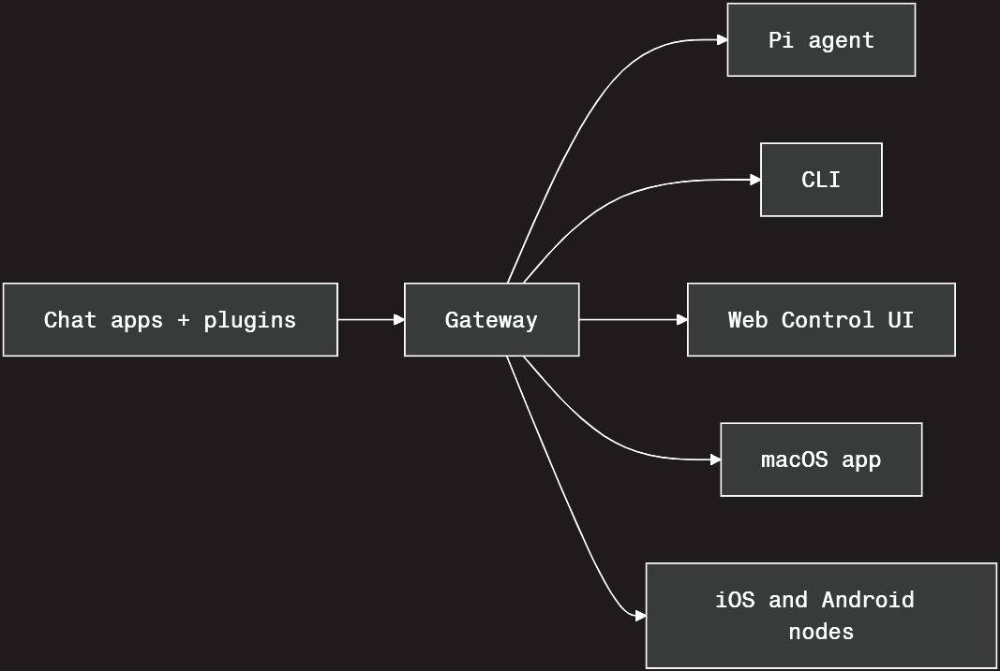
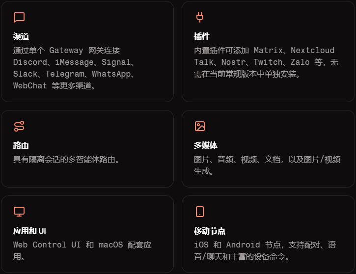
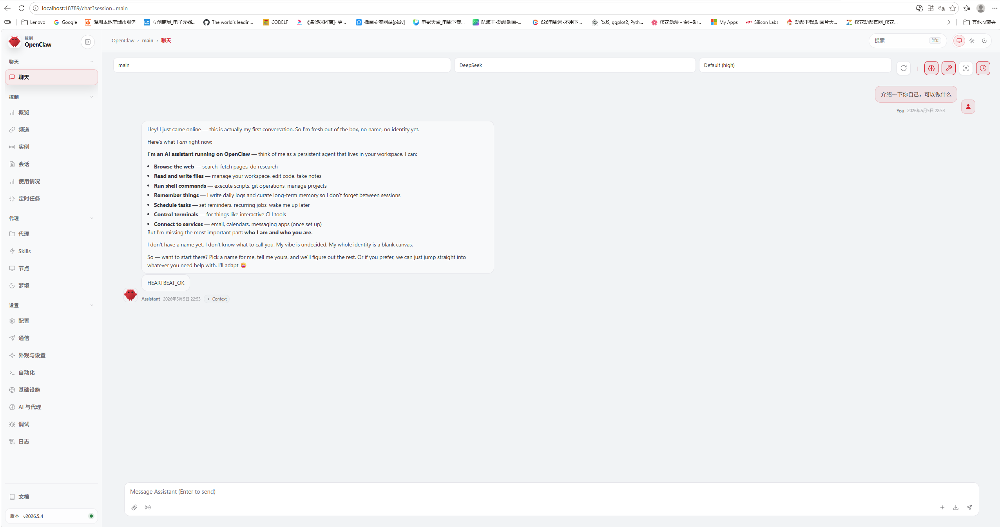
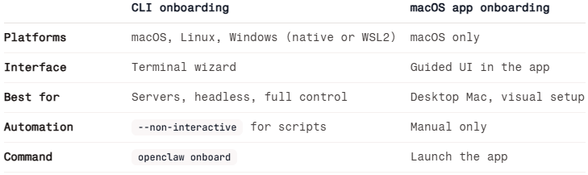
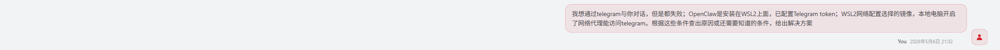
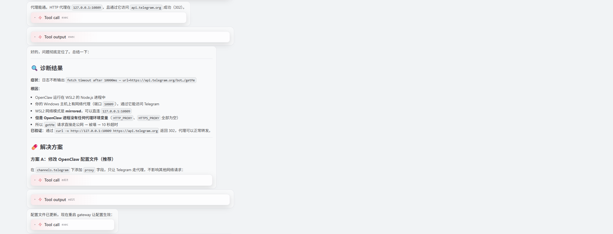
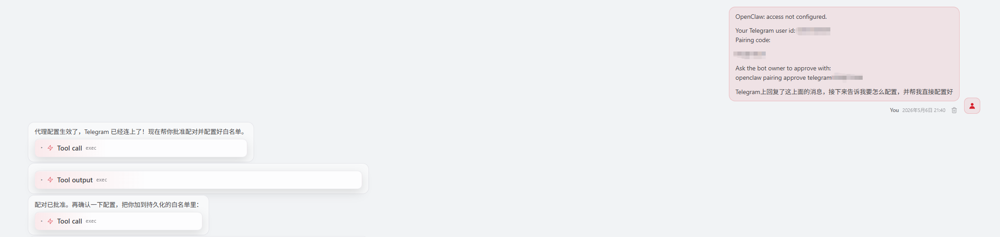

# 定义与简介
OpenClaw是一个开源的自主人工智能（AI）虚拟助理软件项目，因其图标是一只红色龙虾又被称作“龙虾”。OpenClaw由奥地利软件工程师彼得·斯坦伯格开发，最初于2025年末以Clawdbot的名字在GitHub上发布，后更名为Moltbot，最终定为现名。

2026年初，该AI项目因能够根据用户指令，在应用程序和在线服务中自主处理复杂任务而受到广泛关注。
## 功能
OpenClaw被设计为可代替用户执行任务的自主人工智能虚拟助理软件，而非只是对话式聊天机器人。其可部署在MacOS、Windows等本地设备上，并能够调用其他AI大模型与应用程序接口（API），通过WhatsApp、Telegram、Signal、Discord等即时通讯平台接收用户发送的文本指令，实现安排日程、发送消息、整理文件、编写代码等工作。OpenClaw在本地存储配置数据和交互历史，从而拥有较持久的记忆能力。

OpenClaw 拥有对本地系统的操作权限，因此它能做的事情远超普通聊天机器人：

* 文件与系统操作
	* 读写文件：自动整理文件夹、批量重命名文件、备份重要数据。
	* 执行命令：在终端中运行脚本、安装软件、管理系统进程。

* 浏览器自动化
	* 网页操作：自动登录网站、填写表单、抓取数据、监控价格变化。
	* 信息检索：根据指令搜索特定信息，并整理成报告。

* 办公与开发
	- 代码编写：根据需求生成代码片段，甚至修复 Bug。
	- 邮件处理：自动发送邮件、整理收件箱、过滤垃圾邮件。
	- 文档处理：自动生成日报、整理会议纪要。

* 远程控制与定时任务
	- 远程指令：即使你不在电脑前，也可以通过手机发消息让它执行任务。
	- 定时任务：设置定时任务，让它每天自动为你生成天气简报或新闻摘要。

## 风险
OpenClaw在运行时通常需要获取本地设备较高的权限和自主权，因此小的配置错误也可能引发数据泄露，此外还面临提示词攻击、特权提升等风险，并存在多个安全漏洞。

2026年1月29日，Axios的一篇报道指出数百个OpenClaw控制面板因配置错误已暴露在开放互联网上，使得入侵者可以访问对话记录、API密钥和凭证，甚至以用户身份运行命令。

2026年2月23日，Meta一名AI安全研究员通过手机会话指示OpenClaw协助自己整理电子邮箱，并规定“在我指示之前不要执行任何操作”。但由于邮箱内容太大，OpenClaw触发了“上下文压缩”机制并忽视了其指令，导致电子邮箱差点被清空。

2026年2月5日，中华人民共和国工业和信息化部指出OpenClaw在默认或不当配置情况下存在较高安全风险，并建议相关单位和用户使用时充分核查公网暴露、权限配置及凭证管理情况；随后，工业和信息化部下属中国信息通信研究院副院长魏亮在采访中表示应审慎使用OpenClaw；国家互联网应急中心也表示OpenClaw存在四大风险。另据彭博社报道，中国官方已限制国有企业和政府机构在办公电脑上运行OpenClaw。大陆部分高校亦禁止在校内使用OpenClaw。香港网络安全事故协调中心表示应警惕OpenClaw引发的安全风险；香港数字政策办公室也建议使用OpenClaw应采取充足的安全措施。中国国家互联网应急中心随后发布提示，建议普通用户使用专用设备、虚拟机或容器安装OpenClaw，不应在日常办公电脑上安装。

# 资料链接
- 官网：https://openclaw.ai/
- Github：https://github.com/openclaw
- 文档中心：https://docs.openclaw.ai/start/getting-started
- 技能中心：https://clawhub.ai/
- 社区中心：https://discord.com/invite/clawd

# 快速开始
## 概况
OpenClaw 是一个**自托管 Gateway 网关**，可将你喜爱的聊天应用和渠道表面——包括内置渠道，以及内置或外部渠道插件（如 Discord、Google Chat、iMessage、Matrix、Microsoft Teams、Signal、Slack、Telegram、WhatsApp、Zalo 等）——连接到像 Pi 这样的 AI 编码智能体。你只需在自己的机器（或服务器）上运行一个 Gateway 网关进程，它就会成为你的消息应用与始终可用的 AI 助手之间的桥梁。

### 使用
适合开发者和高级用户，他们希望拥有一个可以随时随地发消息的个人 AI 助手——同时又不放弃对自己数据的控制，也不依赖托管服务。

### 特性
- **自托管**：运行在你的硬件上，遵循你的规则。
- **多渠道**：一个 Gateway 网关可同时服务内置渠道以及内置或外部渠道插件。
- **智能体原生**：专为支持工具使用、会话、记忆和多智能体路由的编码智能体打造。
- **开源**：采用 MIT 许可证，由社区驱动。

### 要求
Node 24（推荐），或为了兼容性使用 Node 22 LTS（`22.14+`），你所选提供商的一个 API key，以及 5 分钟时间。为了获得最佳质量与安全性，请使用最新一代中能力最强的模型。

## 工作原理

Gateway 网关是会话、路由和渠道连接的唯一事实来源。
### 框架示意
OpenClaw 采用五大功能模块的微服务架构：

```text
┌─────────────────────────────────────────────────────────┐
│                    消息渠道层                              │
│  WhatsApp │ Telegram │ Slack │ Discord │ 飞书 │ 钉钉      │
└────────────────────────┬────────────────────────────────┘
                         │
                         ▼
┌─────────────────────────────────────────────────────────┐
│              Gateway（核心控制平面）                       │
│  ┌──────────┐ ┌──────────┐ ┌──────────┐ ┌───────────┐  │
│  │ Sessions │ │ Channels │ │  Tools   │ │  Events   │  │
│  └──────────┘ └──────────┘ └──────────┘ └───────────┘  │
│                    localhost:18789                       │
└────────────┬───────────────────┬────────────────────────┘
             │                   │
     ┌───────▼───────┐   ┌──────▼──────┐
     │   Agent 层     │   │  Nodes 层   │
     │ (LLM 决策引擎) │   │ (设备端点)   │
     │ Claude/GPT/    │   │ iOS/Android │
     │ Ollama/Qwen    │   │ Camera/GPS  │
     └───────┬───────┘   └─────────────┘
             │
     ┌───────▼───────┐
     │   Skills 层    │
     │  (插件工具包)   │
     │ Shell/Browser/ │
     │ File/Web/API   │
     └───────────────┘
```

**关键组件说明**：

- **Gateway**: 单一控制平面，所有消息经由此路由，管理认证和会话
- **Agent**: 连接 LLM（Claude、GPT、Ollama 等），理解上下文并制定执行计划
- **Skills**: JS/TS 可扩展工具包，支持 Shell 命令、文件操作、浏览器控制等
- **Channels**: 连接各消息平台，提供统一消息接口
- **Nodes**: 在用户设备上运行的传感器/端点，暴露设备能力

### 技术架构及组件

```
聊天平台（Telegram / WhatsApp / Discord / Signal...）
         │
         ▼
┌─────────────────────────────────────────────┐
│               Gateway                        │  ← 单进程常驻
│  ┌──────────┐  ┌──────────┐  ┌──────────┐   │
│  │ Channels │  │  Agent   │  │   CLI    │   │
│  │ (消息收发)│  │ (推理引擎)│  │ (管理工具)│   │
│  ├──────────┤  ├──────────┤  ├──────────┤   │
│  │  Tools   │  │  Skills  │  │ Plugins  │   │
│  │ (工具集) │  │ (技能说明)│  │ (插件扩展)│   │
│  ├──────────┤  └──────────┘  └──────────┘   │
│  │  Models  │                                │
│  │ (模型层) │                                │
│  └──────────┘                                │
│              WebSocket                       │
│              Control UI ←→ Web 控制台        │
│              节点 (iOS/Android/macOS)         │
└─────────────────────────────────────────────┘
```

核心思想：**一个 Gateway 进程，连通所有消息渠道，对接 AI 模型，统一管理会话**。

#### 各组件详解

##### 🚪 Gateway — 网关总入口

Gateway 是 OpenClaw 的**唯一常驻进程**，负责：

- 持有所有 channel 连接（如 Telegram bot 的长轮询）
- 管理所有 Agent 会话（session）
- 提供 WebSocket API 供 Web 控制台、CLI、移动节点连接
- 处理路由、认证、配对、健康检查
- 热加载配置

你机器上跑的就是 `systemd --user` 托管的 Gateway 进程。

##### 📡 Channels — 消息通道

Channels 是用户跟 AI 对话的**入口/出口**。每个 channel 连接一个聊天平台：

- **内建**：Telegram、WhatsApp、Signal、Slack、Discord、Google Chat、iMessage、IRC、WebChat
- **插件（bundled）**：Matrix、Microsoft Teams、Feishu（飞书）、LINE、Mattermost、Zalo、QQ Bot、Nostr、Twitch 等
- **外部插件**：微信（第三方）、语音通话等

每个 channel 负责：

- 连接平台 API（如 Telegram Bot API）
- 消息收发（发送/接收文本、图片、文件）
- 权限控制（谁可以用、群组策略、@提及规则）

下面配好的 Telegram 就是通过 channels 配置进来的。

##### 🤖 Agent — 智能体运行时

Agent 是**推理引擎**，是实际跟模型交互、执行工具调用的核心。每个 Gateway 内置一个 agent 进程。

工作流程：

1. 用户通过 channel 发消息
2. Gateway 创建 session，加载 workspace（`AGENTS.md`、`SOUL.md` 等）
3. Agent 调用模型（LLM）进行推理
4. 模型决定使用工具（读文件、执行命令等）
5. 工具返回结果，模型继续推理
6. 最终回复通过 channel 返回给用户

支持**多 agent 路由**——不同 workspace、不同 sender 可以走不同的 agent，会话完全隔离。

##### 🛠️ Tools — 工具

Tools 是 agent **可以调用的函数**。模型生成文本之外的所有操作都通过 tools 完成。

内建工具按功能分组：

| 组                  | 工具                                           |
| ------------------ | -------------------------------------------- |
| `group:fs`         | read / write / edit / apply_patch            |
| `group:runtime`    | exec / process                               |
| `group:web`        | web_search / web_fetch / x_search            |
| `group:session`    | sessions_list / sessions_spawn / subagents 等 |
| `group:memory`     | memory_search / memory_get                   |
| `group:automation` | cron / gateway                               |
| `group:media`      | image / image_generate / tts                 |
| `group:messaging`  | message                                      |

工具权限通过 `tools.profile`（`coding` / `full` / `messaging` / `minimal`）和 `tools.allow` / `tools.deny` 控制。

当前用的 `coding` 配置（config 里写的），跑嵌入式开发足够。

##### 📘 Skills — 技能（说明书）

Skills 不是给 agent 调用的函数，而是**教 agent 怎么用工具的说明书**。每个 skill 是一个文件夹，里面有 `SKILL.md` 文件。

**Skills 和 Tools 的区别：**

- **Tools** = 螺丝刀、扳手、电钻（工具本身）
- **Skills** = 使用说明书（教 agent 什么时候用什么工具、怎么用）

Skills 通过 YAML 前置元数据控制加载条件（需要哪些环境变量、二进制文件等），并且按优先级加载：

```
workspace/skills > .agents/skills > ~/.agents/skills > ~/.openclaw/skills > 内建 skills > extraDirs
```

Skills 市场：[clawhub.ai](https://clawhub.ai/)

##### 🔌 Plugins — 插件生态

Plugins 是**最上层的打包单元**，可以一次性注册多种能力：

- **Channel 插件**：新增一个聊天平台（如 Matrix Plugin）
- **Provider 插件**：新增模型供应商（如 OpenAI Plugin）
- **Tool 插件**：注册新的工具（如 `diffs` 插件）
- **Skill 插件**：附带技能文件
- **Hook 插件**：在 agent 执行流程中插入自定义逻辑

插件可以注册的能力（capabilities）：

```
文本推理、语音合成、实时转写、图片生成、视频生成
音乐生成、网页搜索、频道连接、媒体理解 ...
```

插件分三类：

- **bundled**：OpenClaw 自带的
- **第三方 npm 包**：社区发布的
- **本地插件**：自己写的

##### 🧠 Models — 模型层

Models 是 agent **调用的 LLM**。OpenClaw 支持 35+ 模型供应商：

- OpenAI（GPT-4o 等）
- Anthropic（Claude）
- DeepSeek（咱现在用的）
- Google（Gemini）
- Ollama（本地跑）
- vLLM / SGLang（自建）
- 任何 OpenAI 兼容 API

配置方式：

```json5
{
  models: {
    providers: {
      deepseek: {
        baseUrl: "https://api.deepseek.com",
        api: "openai-completions",
        models: [...]
      }
    }
  },
  agents: {
    defaults: {
      model: { primary: "deepseek/deepseek-v4-flash" }
    }
  }
}
```

模型支持 failover（主模型挂了自动切备用），支持 reasoning（思考链）。

### 一句话总结

|组件|比喻|职责|
|---|---|---|
|**Gateway**|总机|进程调度、会话管理、热配置|
|**Channels**|电话线|连接聊天平台，收发消息|
|**Agent**|秘书本人|推理思考、调度工具|
|**Tools**|工具箱|agent 能调用的实际函数|
|**Skills**|说明书|教 agent 怎么用好工具|
|**Plugins**|扩展卡|打包新增 channel / provider / tool|
|**Models**|大脑|背后的 LLM 推理能力|

### 架构术语说明

```text
用户/聊天软件/控制台/移动节点
        ↓
Channels
        ↓
Gateway：长驻进程、路由、认证、会话、WS/HTTP API
        ↓
Agent runtime：工作区、上下文、记忆、session、agent loop
        ↓
Model：LLM 推理
        ↕
Tools：执行动作
        ↑
Skills：给 agent 的工作说明
Plugins：扩展 channels / tools / model providers / hooks / skills
```

* Channels: 聊天/通信入口
  - 例如 Telegram、WhatsApp、Slack、Discord、Signal、iMessage、WebChat 等。每个 channel 通过 Gateway 接入，文本普遍支持，媒体和反应能力按平台不同。多个 channel 可以同时运行。
* Gateway: OpenClaw 的长驻守护进程和控制平面
  - 负责 channel/provider 连接、WebSocket/HTTP API、路由、认证、session、健康事件、插件路由、Control UI。默认本地端口是 127.0.0.1:18789。文档说它是 sessions、routing、channel connections 的 single source of truth。
* Agent: 被 Gateway 调度的 AI 助手实例/“脑”
  - 一个 agent 包含工作区、人格/说明文件、模型配置、认证资料、session 历史。默认是单 agent，也可以在一个 Gateway 中跑多个隔离 agent，并用 bindings 把不同 channel/account/peer 路由过去。
* Tools: 模型可调用的结构化动作函数
  - 如 exec、browser、web_search、message、image_generate、read/write/edit/apply_patch 等。工具让 agent 能读数据、改文件、发消息、操作浏览器或调用外部系统；只有通过策略过滤后的工具 schema 才会给模型看到。
* Skills: 给 agent 的 Markdown 工作说明包
  - 每个 skill 通常是一个目录里的 SKILL.md，包含 frontmatter 和正文，告诉 agent 何时、如何使用已有工具。它本身通常不新增能力，而是把流程、规范、检查清单注入 prompt。
* Plugins: 可安装的运行时扩展代码包
  - 插件可以新增 channels、model providers、tools、skills、hooks、语音、媒体生成、web search/fetch 等。来源可以是 ClawHub、npm、git、本地目录等。
* Model: agent 使用的大语言模型/推理后端
  - OpenClaw 用 provider/model 形式配置模型，例如 openai/gpt-5.5、anthropic/claude-opus-4-6。模型 provider 负责认证、模型目录和调用方式；OpenClaw 负责把上下文、技能、工具定义送入模型并执行工具循环。

总结: Tool 是“能做什么动作”，Skill 是“怎么做这类工作”，Plugin 是“给系统装上新能力”，Model 是“负责推理和决策的大脑”，Gateway 是“把所有这些接起来的中枢”。

### 与 codex 对比
OpenClaw 更像“自托管 AI agent 网关/路由器”：把 WhatsApp、Telegram、Slack、Discord、WebChat 等入口统一接到 agent。Codex 更像“OpenAI 官方 coding agent 产品/运行时”：重点在读代码、改代码、跑测试、代码审查、并行开发任务。两者不是完全同类，OpenClaw 甚至可以把 Codex 当作底层 agent runtime 来用。

```text
OpenClaw:
聊天软件/节点/网页 → Gateway → agent runtime → model + tools + skills/plugins → 回到各聊天 channel

Codex:
Codex app/CLI/IDE/web → 本地或云端工作区 → Codex agent/runtime → coding model + tools → diff/PR/测试结果
```

#### 核心定位对比
| 维度 | OpenClaw | Codex |
| --- | --- | --- |
| 产品定位 | 自托管、多渠道 AI agent Gateway | OpenAI 官方软件开发 agent |
| 第一入口 | 聊天软件、WebChat、移动/桌面节点、CLI、Control UI | Codex app、CLI、IDE extension、Codex web |
| 核心价值 | “随时从任意聊天入口唤起自己的 agent” | “在代码库里高质量完成开发、审查、调试、重构” |
| 部署方式 | 自己运行 Gateway，默认本地 127.0.0.1:18789 | 本地 app/CLI/IDE，也有 Codex Cloud |
| 扩展重点 | channel、provider、tool、skill、hook、agent harness | skills、plugins、MCP、shell/browser/computer-use、cloud tasks |
| 模型选择 | 多 provider，常用 provider/model，如 openai/gpt-5.5、anthropic/... | 官方推荐 Codex 模型，如 gpt-5.5，本地可配置模型；云端任务默认模型当前不可改 |
| 是否开源 | OpenClaw 是开源自托管项目 | Codex CLI/app-server 等组件开源，但 Codex 产品和模型是 OpenAI 托管体系的一部分 |
| 最适合   | 个人/团队想把 AI 助手接入各种聊天渠道 | 开发者想在 repo 内完成真实工程任务 |

#### 概念逐项映射
| OpenClaw 概念 | 在 OpenClaw 中 | Codex 中的近似物 | 关键差异 |
| --- | --- | --- | --- |
| Channels | Telegram、WhatsApp、Slack、Discord、Signal、iMessage、WebChat 等聊天入口，每个 channel 经 Gateway 接入 | Codex 没有同等“多聊天 channel”核心概念；它有 app/CLI/IDE/web，以及 GitHub/Slack/Linear 等集成 | OpenClaw 的 channel 是主战场；Codex 的入口主要围绕代码工作流 |
| Gateway | 长驻守护进程，负责 channel 连接、WebSocket API、路由、认证、session、节点、Control UI | Codex 有 app-server，为 rich clients 提供认证、历史、审批、流式事件 | OpenClaw Gateway 是多渠道中枢；Codex app-server 是 Codex 客户端集成协议，不负责 WhatsApp/Telegram 这类消息路由 |
| Agent | 	OpenClaw agent runtime 管理 workspace、session、bootstrap files、tools、skills、model routing | Codex 本身就是 coding agent，可读写代码、运行命令、审查、调试、自动化开发任务 | OpenClaw 的 agent 更“通用消息助手”；Codex agent 更“工程开发专家” |
| Tools | typed function，如 exec、browser、web_search、message、image_generate、apply_patch 等 | shell、apply patch、web search、MCP、computer use、browser、code tools 等 | shell、apply patch、web search、MCP、computer use、browser、code tools 等 |
| Skills | SKILL.md 指令包，教 agent 何时和如何使用工具 | Codex skills 也是 instructions/resources/scripts 的可复用工作流格式 | Codex skills 也是 instructions/resources/scripts 的可复用工作流格式 |
| Plugins | 可新增 channels、model providers、agent harnesses、tools、skills、hooks、语音、媒体、搜索等 | Codex plugins 打包 skills、app integrations、MCP servers | OpenClaw plugin 更底层、更运行时；Codex plugin 更像可安装的工作流/应用连接包 |
| Model | 多 provider 模型引用，provider/model | Codex 推荐 OpenAI coding models，本地可指定模型，Cloud 当前默认不可改 | OpenClaw 更 provider-agnostic；Codex 更深度绑定 OpenAI coding model 体验 |

#### 最重要的架构差别
OpenClaw 的中心是 Gateway。官方文档说它是 sessions、routing、channel connections 的 single source of truth，并且一个 Gateway 管理 WhatsApp、Telegram、Slack、Discord、Signal、iMessage、WebChat 等消息面。也就是说，它解决的是“我从哪里和 agent 对话、怎么路由到正确 agent、怎么回到原聊天平台”。

Codex 的中心是 coding agent runtime/client surface。官方定义 Codex 是 OpenAI 的软件开发 coding agent，可写代码、理解代码库、审查、调试、自动化开发任务；CLI 可在本机目录读写和运行代码，Codex web 可在云端后台并行执行任务。

#### 二者可以组合
OpenClaw 文档明确有 bundled codex plugin，可以让 OpenClaw 通过 Codex app-server 运行 OpenAI agent turns。此时边界大致是：

```text
Telegram/WhatsApp/Slack
        ↓
OpenClaw Gateway：channel、路由、会话镜像、媒体投递、OpenClaw 工具/审批
        ↓
Codex app-server：Codex thread、native tool continuation、native compaction、底层 agent execution
        ↓
OpenAI model，如 gpt-5.5
```

openai/gpt-5.5 是 model ref，codex 是 runtime，Telegram/Discord/Slack 等仍然是 communication surface。

## 功能
### 亮点


### 完整列表

**渠道：**

- 内置渠道包括 Discord、Google Chat、iMessage（旧版）、IRC、Signal、Slack、Telegram、WebChat 和 WhatsApp
- 内置插件渠道包括适用于 iMessage 的 BlueBubbles、Feishu、LINE、Matrix、Mattermost、Microsoft Teams、Nextcloud Talk、Nostr、QQ Bot、Synology Chat、Tlon、Twitch、Zalo 和 Zalo Personal
- 可选的单独安装渠道插件包括 Voice Call 和 WeChat 等第三方软件包
- 第三方渠道插件可进一步扩展 Gateway 网关，例如 WeChat
- 支持基于提及激活的群聊
- 通过允许列表和配对机制保障私信安全

**智能体：**

- 具有工具流式传输的内置智能体运行时
- 按工作区或发送方隔离会话的多智能体路由
- 会话：私聊会合并到共享的 `main`；群组彼此隔离
- 针对长回复的流式传输与分块

**认证和提供商：**

- 35+ 模型提供商（Anthropic、OpenAI、Google 等）
- 通过 OAuth 的订阅认证（例如 OpenAI Codex）
- 自定义和自托管提供商支持（vLLM、SGLang、Ollama，以及任何兼容 OpenAI 或兼容 Anthropic 的端点）

**多媒体：**

- 图片、音频、视频和文档的输入与输出
- 共享的图片生成和视频生成能力表面
- 语音消息转录
- 支持多个提供商的文本转语音

**应用和界面：**

- WebChat 和浏览器 Control UI
- macOS 菜单栏配套应用
- iOS 节点，支持配对、Canvas、相机、屏幕录制、定位和语音
- Android 节点，支持配对、聊天、语音、Canvas、相机和设备命令

**工具和自动化：**

- 浏览器自动化、exec、沙箱隔离
- Web 搜索（Brave、DuckDuckGo、Exa、Firecrawl、Gemini、Grok、Kimi、MiniMax Search、Ollama Web 搜索、Perplexity、SearXNG、Tavily）
- Cron 作业和心跳调度
- Skills、插件和工作流管线（Lobster）
## 安装
### 要求
* Node.js — 推荐使用 Node 24（亦支持 Node 22.14 及更高版本）
* 来自模型提供商（如 Anthropic、OpenAI、Google 等）的 API 密钥 — 入门设置流程中将提示您提供

运行 `node --version` 命令以检查您的 Node 版本。Windows 用户请注意：原生 Windows 环境和 WSL2 均受支持。其中，WSL2 更加稳定，建议使用以获得完整的体验。

### 快速设置
1. 安装 OpenClaw

		curl -fsSL https://openclaw.ai/install.sh | bash

2. 运行引导

		openclaw onboard --install-daemon

	该向导将引导完成选择模型提供商、设置 API 密钥和配置网关的过程。

3. 验证网关运行

		openclaw gateway status

	应该能看到网关正在监听端口 18789。

4. 打开仪表板

		openclaw dashboard

	这会在浏览器中打开控制界面。如果界面能够加载，说明一切运行正常。

5. 发送消息

	在控制界面的聊天窗口中输入消息，即可收到 AI 的回复。如果想改用手机进行聊天，最快捷的设置渠道是 Telegram（仅需一个 Bot Token）。

#### WSL2打开仪表板失败问题

使用 `openclaw dashboard` 报错如下：

```
miao@Master-Li:~$ openclaw dashboard

🦞 OpenClaw 2026.5.4 (325df3e) — You had me at 'openclaw gateway start.'

Dashboard URL: http://127.0.0.1:18789/
Token auto-auth included in browser/clipboard URL.
Copied to clipboard.
No GUI detected. Open from your computer:
ssh -N -L 18789:127.0.0.1:18789 miao@<host>
Then open:
http://localhost:18789/
Docs:
https://docs.openclaw.ai/gateway/remote
https://docs.openclaw.ai/web/control-ui
```

这是因为在无图形界面的服务器环境下，`openclaw dashboard` 命令无法自动将身份验证令牌传给浏览器。解决方法如下：

##### ssh连接

在**你的本地电脑**（而不是服务器）的终端里，运行这个 SSH 端口转发命令：

	ssh -N -L 18789:127.0.0.1:18789 miao@<你的服务器IP或域名>

把 `<你的服务器IP或域名>` 换成你服务器的实际地址，包括“<>”。

> 可以不需要 SSH 隧道，WSL2 新版本支持 **localhost 转发**，即 WSL2 内部监听 `127.0.0.1` 的服务，Windows 可以直接通过 `localhost` 访问。即可**直接**在 Windows 浏览器打开：`http://localhost:18789/`

##### 打开链接

在本地电脑的浏览器里打开 `http://localhost:18789/`，就能访问到 OpenClaw 的控制界面了。

##### 输入 Token 进行认证

运行 `openclaw dashboard` 后，URL 和 token 已经在剪切板，然后可将其粘贴到文本进行查看和复制，示例如下：

	http://127.0.0.1:18789/#token=5de12ae17e7728e3cc6fc3f4f29af3c2a23f7349526d861b

`token=` 字符串后面的字符串即为 token。

##### 仪表板显示



## 引导说明
OpenClaw 提供了两条引导路径。这两条路径均涵盖了身份验证、网关以及可选的聊天频道配置——二者的区别仅在于您与设置流程的交互方式不同。
### 方式

大多数用户应从 CLI 入门开始——它适用于所有环境，并能为您提供最大的控制权。

### 引导配置的内容
无论选择哪种路径，引导配置流程都会完成以下设置：
* 模型提供商与认证 — 为选定的提供商配置 API 密钥、OAuth 或设置令牌
* 工作区 — 用于存放代理文件、引导模板及记忆数据的目录
* 网关 — 端口、绑定地址及认证模式
* 通道（可选）— 内置及捆绑的聊天通道，例如 BlueBubbles、Discord、飞书（Feishu）、Google Chat、Mattermost、Microsoft Teams、Telegram、WhatsApp 等
* 守护进程（可选）— 后台服务，确保网关能够自动启动

### 引导CLI
在任意终端中运行：

	openclaw onboard

添加 `--install-daemon` 参数，即可一步到位同时安装后台服务。

### 使用自定义或未列出的模型
如果要使用的服务提供商未列入入驻向导中，请选择“自定义提供商”，并填写以下信息：

* API 兼容模式（兼容 OpenAI、兼容 Anthropic 或自动检测）
* 基础 URL 和 API 密钥
* 模型 ID（以及可选的别名）

多个自定义端点可以共存——每个端点均拥有独立的端点 ID。

## 引导CLI
通过 CLI 进行引导式设置，是配置 macOS、Linux 或 Windows（强烈推荐通过 WSL2）上 OpenClaw 的首选方式。它通过一套引导流程，即可一站式完成本地或远程网关连接、频道、技能以及工作区默认设置的配置。

	openclaw onboard

若需稍后重新配置：

	openclaw configure 
	openclaw agents add <name>

CLI 入门设置包含一个网页搜索配置步骤，您可以在此选择 Brave、DuckDuckGo、Exa、Firecrawl、Gemini、Grok、Kimi、MiniMax Search、Ollama Web Search、Perplexity、SearXNG 或 Tavily 等服务提供商。部分提供商需要 API 密钥，而另一些则无需密钥。也可以稍后通过运行 `openclaw configure --section web` 命令来进行配置。

### 快速入门 vs 高级模式
引导始于“快速入门”（默认设置）与“高级模式”（完全控制）的选择。

#### 快速入门
* 本地网关（回环模式）
* 工作区默认设置（或现有工作区）
* 网关端口：18789
* 网关认证令牌（自动生成，即使在回环模式下也是如此）
* 新本地部署的工具策略默认设置：`tools.profile: "coding"`（若已显式指定现有配置文件，则予以保留）
* DM 隔离默认设置：本地初始化时，若未显式设置 `session.dmScope`，则默认写入 `"per-channel-peer"`。
* Tailscale 暴露功能：关闭
* Telegram 与 WhatsApp 的 DM 默认启用白名单模式（系统将提示您输入手机号码）

#### 高级模式
公开每一个步骤（模式、工作区、网关、通道、守护进程、技能）。

### 引导配置的内容
本地模式（默认）将引导完成以下步骤：
1. 模型/认证 —— 选择任何受支持的提供商/认证流程（API 密钥、OAuth 或特定于提供商的手动认证），包括自定义提供商（兼容 OpenAI、兼容 Anthropic 或自动检测未知类型）。请选择一个默认模型。安全提示：如果该代理（Agent）需要运行工具或处理 Webhook/钩子内容，建议优先选用当前可用的最强大、最新一代的模型，并保持严格的工具策略。性能较弱或较旧的模型层级更容易受到“提示注入”（Prompt Injection）攻击。对于非交互式运行，使用 `--secret-input-mode ref` 参数可以将基于环境变量的引用存储在认证配置文件中，而非直接存储明文的 API 密钥值。在非交互式的引用模式下，必须设置相应的提供商环境变量；若未设置该环境变量却试图通过命令行参数直接传入密钥，程序将立即报错并终止运行。对于交互式运行，选择“密钥引用模式”允许您指定一个环境变量，或指定一个已配置的提供商引用（可以是文件路径或可执行命令），并在保存前执行快速的预检验证。针对 Anthropic 服务，交互式的配置向导会将“Anthropic Claude CLI”推荐为首选的本地认证路径，并将“Anthropic API 密钥”推荐为首选的生产环境认证路径。此外，“Anthropic setup-token”作为一种受支持的令牌认证方式，依然可供选用。
2. 工作区 —— 代理文件的存放位置（默认为 `~/.openclaw/workspace`）。用于存放引导文件。
3. 网关 — 端口、绑定地址、认证模式、Tailscale 暴露设置。在交互式令牌模式下，可选择默认的明文令牌存储方式，或启用 SecretRef。非交互式令牌的 SecretRef 路径：`--gateway-token-ref-env <ENV_VAR>`。
4. 频道 —— 内置及捆绑的聊天频道，例如 BlueBubbles、Discord、飞书、Google Chat、Mattermost、Microsoft Teams、QQ 机器人、Signal、Slack、Telegram、WhatsApp 等。
5. Daemon —— 安装 LaunchAgent（macOS）、systemd 用户单元（Linux/WSL2），或原生 Windows 计划任务（并提供基于用户启动文件夹的备用方案）。如果令牌认证要求提供令牌，且 `gateway.auth.token` 由 SecretRef 管理，Daemon 安装过程会对其进行验证，但不会将解析出的令牌持久化存储到 Supervisor 服务的环境元数据中。如果令牌认证要求提供令牌，但配置的令牌 SecretRef 未能成功解析，Daemon 安装过程将被阻断，并提供相应的解决指引。如果同时配置了 `gateway.auth.token` 和 `gateway.auth.password`，且未设置 `gateway.auth.mode`，Daemon 安装过程将被阻断，直至明确设置该模式为止。
6. 健康检查 —— 启动网关并验证其正在运行。
7. 技能 — 安装推荐的技能及可选依赖项。

> 重新运行引导流程（onboarding）不会清除任何数据，除非您明确选择了“重置”（Reset）选项（或传递了 `--reset` 参数）。CLI 的 `--reset` 参数默认仅重置配置、凭据和会话；若需连同工作区一并重置，请使用 `--reset-scope full` 参数。如果当前配置无效或包含旧版键值，引导流程将提示您先运行 `openclaw doctor` 命令进行诊断。

远程模式仅配置本地客户端以连接至位于远端的网关，而不会在远程主机上安装或更改任何内容。

### 添加另一位代理
使用 `openclaw agents add <name>` 命令可创建一个独立的代理（Agent），该代理拥有专属的工作区、会话及认证配置文件。若运行命令时未指定 `--workspace` 参数，系统将自动启动引导配置流程。

该命令设置的配置项包括：
* `agents.list[].name`
* `agents.list[].workspace`
* `agents.list[].agentDir`

注意事项：
* 默认工作区路径为 `~/.openclaw/workspace-<agentId>`。
* 请添加绑定规则以路由入站消息（此操作也可在引导配置流程中完成）。
* 非交互模式参数：`--model`、`--agent-dir`、`--bind`、`--non-interactive`。

## 个人助理设置
OpenClaw 是一款自托管网关，能够将 Discord、Google Chat、iMessage、Matrix、Microsoft Teams、Signal、Slack、Telegram、WhatsApp、Zalo 等平台连接至 AI 代理。本指南将介绍“个人助理”模式的配置方法：即利用一个专用的 WhatsApp 号码，使其充当您全天候在线的 AI 助理。

### 安全第一
您正在赋予代理以下权限：
* 在您的机器上执行命令（具体取决于您的工具策略）
* 读取/写入您工作区内的文件
* 通过 WhatsApp、Telegram、Discord、Mattermost 以及其他内置渠道向外发送消息

建议采取保守策略：
* 务必配置 `channels.whatsapp.allowFrom` 参数（切勿在您的个人 Mac 上开启“对全网开放”的模式）。
* 为该助理专门配置一个专用的 WhatsApp 号码。
* “心跳检测”（Heartbeat）功能现已默认为每 30 分钟执行一次。在您完全信任当前配置之前，建议通过设置 `agents.defaults.heartbeat.every: "0m"` 来将其禁用。

### 先决条件
* 已安装并完成 OpenClaw 的初始设置。
* 一个用于助理的备用电话号码（SIM 卡、eSIM 或预付费卡）。

# 安装
## 系统要求
* 推荐使用 Node 24 或 Node 22.14+——安装脚本会自动处理版本问题。
* 支持 macOS、Linux 或 Windows——原生 Windows 和 WSL2 均受支持；WSL2 更稳定。
* 仅当您从源代码构建时才需要 pnpm。
## 安装脚本（推荐）
最快的安装方式。它会自动检测您的操作系统，如有需要则安装 Node，随后安装 OpenClaw 并启动新手引导。
Linux命令

	curl -fsSL https://openclaw.ai/install.sh | bash

若要在不运行新手引导的情况下进行安装：

	curl -fsSL https://openclaw.ai/install.sh | bash -s -- --no-onboard

## 备选安装方法
### 本地前缀安装程序 (install-cli.sh)
当您希望将 OpenClaw 和 Node 安装在诸如 `~/.openclaw` 之类的本地前缀目录下，且不依赖于系统全局的 Node 安装时，请使用此选项。

	curl -fsSL https://openclaw.ai/install-cli.sh | bash

它默认支持通过 npm 进行安装，同时也支持在同一前缀目录下通过 git checkout 方式进行安装。

如已经安装过了，可以通过运行 `openclaw update --channel dev` 和 `openclaw update --channel stable` 来在包安装与 Git 安装模式之间进行切换。

### npm

	npm install -g openclaw@latest
	openclaw onboard --install-daemon

### 从源代码安装
对于贡献者，或任何希望从本地检出副本运行的人员：

	git clone https://github.com/openclaw/openclaw.git
	cd openclaw
	pnpm install && pnpm build && pnpm ui:build
	pnpm link --global
	openclaw onboard --install-daemon

或者跳过链接步骤，直接在仓库内部运行 `pnpm openclaw ...`。

### 从 GitHub main 分支安装

	npm install -g github:openclaw/openclaw#main

## 验证安装

	openclaw --version      # confirm the CLI is available
	openclaw doctor         # check for config issues
	openclaw gateway status # verify the Gateway is running

如果您希望在安装后实现托管启动：

* macOS：通过 `openclaw onboard --install-daemon` 或 `openclaw gateway install` 命令配置为 LaunchAgent。
* Linux/WSL2：通过上述相同命令配置为 systemd 用户服务。
* 原生 Windows：首选配置为“计划任务”；若因权限不足导致任务创建失败，则回退至配置为“用户启动文件夹”中的登录项。

## 安装程序内部机制

OpenClaw 附带三个安装脚本，托管于 openclaw.ai。

| Script                                                                       | Platform             | What it does                                                                   |
| ---------------------------------------------------------------------------- | -------------------- | ------------------------------------------------------------------------------ |
| [`install.sh`](https://docs.openclaw.ai/install/installer#installsh)         | macOS / Linux / WSL  | 如有需要，将安装 Node；通过 npm（默认）或 git 安装 OpenClaw；并可运行新手引导。                            |
| [`install-cli.sh`](https://docs.openclaw.ai/install/installer#install-clish) | macOS / Linux / WSL  | 通过 npm 或 git checkout 模式，将 Node 和 OpenClaw 安装至本地前缀目录（~/.openclaw）下。无需 root 权限。 |
| [`install.ps1`](https://docs.openclaw.ai/install/installer#installps1)       | Windows (PowerShell) | 如有需要，将安装 Node；通过 npm（默认）或 git 安装 OpenClaw；并可运行新手引导。                            |

### install.sh
#### 流程

1. 检测操作系统
	* 支持 macOS 和 Linux（包括 WSL）。若检测到 macOS，且未安装 Homebrew，则会自动安装。
2. 默认确保使用 Node.js 24
	* 检查 Node 版本，并在必要时安装 Node 24（在 macOS 上使用 Homebrew，在 Linux apt/dnf/yum 系统上使用 NodeSource 安装脚本）。出于兼容性考量，OpenClaw 仍支持 Node 22 LTS（目前为 22.14+）。
3. 确保 Git 已安装
	* 如果 Git 缺失，则进行安装。
4. 安装 OpenClaw
	* npm 方式（默认）：执行全局 npm 安装
	* git 方式：克隆/更新仓库，使用 pnpm 安装依赖，执行构建，随后将包装脚本安装至 ~/.local/bin/openclaw
5. 安装后任务
	* 尽力刷新已加载的网关服务（执行 `openclaw gateway install --force`，随后重启）
	* 在执行升级及 Git 安装操作时，运行 `openclaw doctor --non-interactive`（尽力而为）
	* 在适当时机尝试执行入驻流程（需满足以下条件：TTY 可用、入驻功能未被禁用，且引导/配置检查均通过）
	* 默认设置 `SHARP_IGNORE_GLOBAL_LIBVIPS=1`

## 更新

### openclaw update（推荐）

最快的更新方式。它会自动检测您的安装类型（npm 或 git），获取最新版本，运行 `openclaw doctor`，并重启网关。

	openclaw update

若要切换频道或指定特定版本：

```
openclaw update --channel beta
openclaw update --channel dev
openclaw update --tag main
openclaw update --dry-run   # preview without applying
```

`openclaw update` 命令不支持 `--verbose` 选项。若需进行更新诊断，请使用 `--dry-run` 来预览计划执行的操作，使用 `--json` 获取结构化的结果，或者运行 `openclaw update status --json` 来检查通道（channel）及可用性状态。安装程序自身虽包含 `--verbose` 标志，但该标志并非 `openclaw update` 命令的一部分。

使用 `--channel beta` 时，系统会优先选用 beta 版本；但若 beta 标签缺失，或其版本早于最新的稳定版（stable），运行时环境将自动回退至 `stable/latest` 版本。如果您仅需针对特定软件包执行一次性更新，并希望直接获取 NPM 仓库中原始的 beta 分发标签（dist-tag），请使用 `--tag beta`。

#### 在 npm 和 git 安装方式之间切换

当您需要更改安装类型时，请使用“通道”（Channels）。更新程序会将您的状态、配置、凭据及工作区保存在 `~/.openclaw` 目录下；它仅负责切换 CLI 和网关所引用的 OpenClaw 代码安装版本。

```
# npm package install -> editable git checkout
openclaw update --channel dev

# git checkout -> npm package install
openclaw update --channel stable
```

运行 `--dry-run`，可以预览确切的安装模式切换操作。

```
openclaw update --channel dev --dry-run
openclaw update --channel stable --dry-run
```

Dev 通道会执行 Git 检出操作，构建项目，并从该检出版本中安装全局 CLI。Stable 和 Beta 通道则采用软件包安装方式。如果网关已安装，`openclaw update` 命令将刷新服务元数据并重启服务，除非您指定了 `--no-restart` 参数。

### 重新运行安装程序（备选）

	curl -fsSL https://openclaw.ai/install.sh | bash

添加 `--no-onboard` 参数可跳过新手引导流程。若需通过安装程序强制指定特定的安装方式，请传入 `--install-method git --no-onboard` 或 `--install-method npm --no-onboard`。

如果在 npm 包安装阶段之后执行 `openclaw update` 失败，请重新运行安装程序。该安装程序不会调用旧版更新器；它会直接执行全局包安装操作，从而能够修复处于部分更新状态的 npm 安装环境。

	curl -fsSL https://openclaw.ai/install.sh | bash -s -- --install-method npm

若要将恢复操作锁定至特定版本或 dist-tag，请添加 `--version` 参数。

	curl -fsSL https://openclaw.ai/install.sh | bash -s -- --install-method npm --version <version-or-dist-tag>

### 更新结果检查

1. 运行 doctor 命令

		openclaw doctor

2. 迁移配置、审计 DM 策略并检查网关健康状况。
3. 重启网关

		openclaw gateway restart

4. 校验

		openclaw health

### 回滚

#### 锁定版本 (npm)

```
npm i -g openclaw@<version>
openclaw doctor
openclaw gateway restart
```

> `npm view openclaw version` 显示当前已发布的版本。

#### 锁定提交（源码）

```
git fetch origin
git checkout "$(git rev-list -n 1 --before=\"2026-01-01\" origin/main)"
pnpm install && pnpm build
openclaw gateway restart
```

要回到最新状态：git checkout main && git pull。

## 卸载

两条路径：

* 简易路径：如果 Openclaw 仍处于安装状态。
* 手动移除服务：如果 CLI 已缺失，但服务仍在运行。

### 简易路径（CLI 仍已安装）

推荐使用内置卸载程序：

	openclaw uninstall

非交互式（自动化 / npx）：

```
openclaw uninstall --all --yes --non-interactive
npx -y openclaw uninstall --all --yes --non-interactive
```

## 发布渠道

OpenClaw 提供三种更新渠道：

* stable（稳定版）：对应 npm dist-tag `latest`。推荐大多数用户使用。
* beta（测试版）：对应 npm dist-tag `beta`（仅当该标签指向最新版本时有效）；如果 `beta` 标签缺失，或其指向的版本早于最新的稳定版，更新流程将自动回退至 `latest` 版本。
* dev（开发版）：对应 Git 仓库 `main` 分支的最新提交（moving head）。对应的 npm dist-tag 为 `dev`（仅在发布时存在）。`main` 分支主要用于实验性探索和活跃开发，其中可能包含尚未完成的功能或具有破坏​​性的变更。请勿将其用于生产环境下的网关部署。

我们通常会将稳定版构建首先发布至 `beta` 渠道进行测试；待测试通过后，我们会执行一个明确的“晋升”操作，将该已验证的构建版本正式移至 `latest` 渠道，且在此过程中不更改版本号。如有需要，维护者也可以将稳定版直接发布至 `latest` 渠道。对于 npm 安装而言，这些分发标签（dist-tags）即是其获取版本信息的唯一权威来源。

### 切换渠道

```
openclaw update --channel stable
openclaw update --channel beta
openclaw update --channel dev
```

--channel 参数会将您的选择持久化保存至配置文件 (update.channel) 中，并据此调整安装方式：

* stable（包安装）：通过 npm dist-tag latest 获取更新。
* beta（包安装）：优先使用 npm dist-tag beta；若 beta 标签缺失，或其版本低于当前的 stable 标签，则回退至 latest 标签。
* stable（Git 安装）：检出最新的 stable Git 标签。
* beta（Git 安装）：优先检出最新的 beta Git 标签；若 beta 标签缺失，或其版本较旧，则回退至最新的 stable Git 标签。
* dev：确保已完成 Git 检出操作（默认路径为 ~/openclaw，可通过 OPENCLAW_GIT_DIR 环境变量覆盖），随后切换至 main 分支，基于上游仓库进行变基（rebase），执行构建，并从该本地检出副本中安装全局 CLI 工具。

### 一次性版本或标签定位

使用 `--tag` 参数，即可针对特定的分发标签（dist-tag）、版本或包规范执行单次更新，而无需更改您已持久化的通道设置：

```
# Install a specific version
openclaw update --tag 2026.4.1-beta.1

# Install from the beta dist-tag (one-off, does not persist)
openclaw update --tag beta

# Install from GitHub main branch (npm tarball)
openclaw update --tag main

# Install a specific npm package spec
openclaw update --tag openclaw@2026.4.1-beta.1
```

说明：

* --tag 仅适用于包管理器（npm）安装；Git 安装会忽略此参数。
* 该标签设置不会被持久化保存。下次执行 `openclaw update` 时，系统仍将照常使用您此前配置的更新通道。
* 降级保护：如果目标版本低于您当前的版本，OpenClaw 会提示您进行确认（您可以使用 --yes 参数跳过此确认步骤）。
* --channel beta 与 --tag beta 有所不同：使用 --channel beta 时，若 beta 版本缺失或版本较旧，系统会自动回退至 stable/latest 版本；而 --tag beta 则仅针对当前这一次运行，强制指定使用原始的 beta dist-tag（分发标签）版本。

### 空运行（Dry run）

预览 openclaw update 将执行的操作，但不进行任何实际更改：

```
openclaw update --dry-run
openclaw update --channel beta --dry-run
openclaw update --tag 2026.4.1-beta.1 --dry-run
openclaw update --dry-run --json
```

空运行结果显示了生效的通道、目标版本、计划执行的操作，以及是否需要降级确认。

### 插件与渠道

当您通过 `openclaw update` 命令切换频道时，OpenClaw 也会同步插件源：

* `dev` 频道优先使用来自 Git 检出（checkout）的捆绑插件。
* `stable` 和 `beta` 频道则恢复通过 npm 安装的插件包。
* npm 安装的插件会在核心更新完成后进行更新。

### 检查当前状态

	openclaw update status

显示当前活跃的通道、安装类型（Git 或软件包）、当前版本以及来源（配置、Git 标签、Git 分支或默认值）。

# 聊天渠道

OpenClaw 可以在您常用的任何聊天应用上与您交流。每个频道均通过“网关”（Gateway）进行连接。文本消息在所有渠道均受支持；而多媒体内容及表情反应的支持情况，则视具体频道而异。

* 各通道可同时运行；只需配置多个通道，OpenClaw 便会根据具体对话自动进行路由分发。
* 通常而言，Telegram 的设置最为快捷（仅需简单的 Bot Token）。相比之下，WhatsApp 需要通过扫描二维码进行配对，且会在本地磁盘上存储更多的状态数据。
* 各通道对群组行为的处理方式不尽相同。
* 为了确保安全性，系统强制实施私信配对及白名单机制。

## Telegram

基于 grammY 实现，支持机器人私信及群组。默认采用长轮询模式，Webhook 模式可选。

### 快速设置

1. 在 BotFather 中创建机器人令牌
	* 打开 Telegram 并与 @BotFather 进行对话（请确认用户名确为 @BotFather）。
	* 运行 `/newbot` 命令，按照提示操作，并保存获取到的 Token。
2. 配置令牌与 DM 策略

		{
		  channels: {
		    telegram: {
		      enabled: true,
		      botToken: "123:abc",
		      dmPolicy: "pairing",
		      groups: { "*": { requireMention: true } },
		    },
		  },
		}
3. 启动网关并批准首条私信

		openclaw gateway
		openclaw pairing list telegram
		openclaw pairing approve telegram <CODE>
	配对码在 1 小时后过期。

### 问题记录与处理

#### WSL2外网问题

`openclaw logs --follow` 诊断日志如下：

```
warn fetch-timeout  fetch timeout reached; aborting operation
                    url=https://api.telegram.org/bot830992…Qn6g/getMe

warn telegram/network  fetch fallback: DNS-resolved IP unreachable;
                       trying alternative Telegram API IP
                       (codes=UND_ERR_CONNECT_TIMEOUT)

error channels/telegram  telegram deleteWebhook failed:
                         Network request for 'deleteWebhook' failed!

error channels/telegram  Telegram command sync failed:
                         HttpError: Network request for 'setMyCommands' failed!
```

根据诊断信息，Telegram 不可用的根本原因是 **OpenClaw 无法连接到 Telegram Bot API（`api.telegram.org`）**，所有网络请求均超时。

##### 基础网络测试与处理

	curl -v --connect-timeout 10 https://api.telegram.org/bot<你的token>/getMe

若超时 ，网络全局无法直连 Telegram，必须使用代理。

可配置WSL2网络为镜像模式，同时开启自动代理，来直接使用Windows 配置的代理。

```
[wsl2]
networkingMode=Mirrored # 开启镜像网络
dnsTunneling=true # 开启 DNS Tunneling
autoProxy=true # 开启自动同步代理
```

##### OpenClaw 进程配置代理

若全局代理能通。HTTP 代理在 `127.0.0.1:10809`，且通过它访问 `api.telegram.org` 成功，日志不断输出 `fetch timeout after 10000ms — url=https://api.telegram.org/bot…/getMe` ，根因为：
- OpenClaw 运行在 WSL2 的 Node.js 进程中
- 你的 Windows 主机上有网络代理（端口 `10809`），通过它能访问 Telegram
- WSL2 网络模式是 **mirrored**，可以直连 `127.0.0.1:10809`
- **但是 OpenClaw 进程没有任何代理环境变量**（`HTTP_PROXY`、`HTTPS_PROXY` 全部为空）
- 所以 `getMe` 请求直接走公网 → 被墙 → 10 秒超时

修改 OpenClaw 配置文件（推荐），在 `channels.telegram` 下添加 `proxy` 字段，只让 Telegram 走代理，不影响其他网络请求。更新后，重启 gateway 让配置生效。

##### 直接在 dashboard 中让openclaw自己诊断与修复

也可以直接在 `openclaw dashboard` 网页中将问题反馈到openclaw，让其诊断并自动解决，如下实例：







# Agent
## 网关架构
### 概述

* 一个单一且长期运行的网关（Gateway）负责管理所有的消息通信接口（包括通过 Baileys 集成的 WhatsApp、通过 grammY 集成的 Telegram，以及 Slack、Discord、Signal、iMessage 和 WebChat）。
* 控制平面客户端（如 macOS 应用程序、命令行界面 [CLI]、Web UI 及自动化脚本）通过 WebSocket 连接至该网关，连接地址为预设的绑定主机（默认为 127.0.0.1:18789）。
* 各类节点（涵盖 macOS、iOS、Android 平台及无头模式 [headless]）同样通过 WebSocket 进行连接，但在连接时会明确声明其角色为“节点”（node），并指明其所具备的特定能力（capabilities）及支持的命令集。
* 每台主机仅部署一个网关实例；该网关是唯一负责建立 WhatsApp 会话的实体。
* 网关内置的 HTTP 服务器负责托管“画布”（Canvas）主机服务，其访问路径如下：
	* /__openclaw__/canvas/ （包含代理人员可编辑的 HTML、CSS 和 JS 资源）
	* /__openclaw__/a2ui/ （A2UI 宿主界面） 该服务沿用网关所使用的端口（默认为 18789）。

### 组件与流程
#### 网关Gateway（守护进程）

* 维护与服务提供商的连接。
* 提供类型化的 WS API（包含请求、响应及服务器推送事件）。
* 依据 JSON Schema 对入站帧进行校验。
* 触发各类事件，涵盖坐席、聊天、在线状态、健康状态、心跳及定时任务等。

#### 客户端Clients（Mac App / 命令行工具 / Web 管理界面）

* 每个客户端建立一个 WebSocket 连接。
* 发送请求（健康状态、状态信息、发送消息、代理信息、系统在线状态）。
* 订阅事件（心跳、代理状态、在线状态、关机）。

#### 节点Nodes（macOS / iOS / Android / 无头模式headless）

* 以“node”角色连接至同一 WS 服务器。
* 在连接时提供设备身份标识；配对机制基于设备（针对“node”角色），且配对审批状态存储于设备配对仓库中。
* 开放诸如 canvas.*、camera.*、screen.record 和 location.get 等指令。

> Gateway WS 协议是 OpenClaw 的统一控制平面与节点传输层。所有客户端（包括 CLI、Web UI、macOS 应用程序、iOS/Android 节点以及无头节点）均通过 WebSocket 建立连接，并在握手阶段声明其角色与作用域。

#### 网页聊天WebChat

* 采用 Gateway WS API 实现聊天历史获取与消息发送的静态 UI。
* 在远程部署场景下，通过与其他客户端相同的 SSH/Tailscale 隧道进行连接。

## 代理运行时Agent runtime

OpenClaw 运行的是单一的嵌入式代理运行时——即每个网关对应一个代理进程，并拥有独立的 workspace（工作空间）、引导文件和会话存储。该运行时的契约：即 workspace 必须包含哪些内容、哪些文件会被注入，以及会话是如何基于该环境进行引导的。

### 工作区

OpenClaw 使用单一的代理工作区目录（`agents.defaults.workspace`）作为代理用于存放工具和上下文的唯一工作目录（cwd）。

建议：运行 `openclaw setup` 命令，若配置文件缺失，该命令将创建 `~/.openclaw/openclaw.json`，并初始化工作区文件。

如果启用了 `agents.defaults.sandbox`，非主会话（non-main sessions）可以通过在 `agents.defaults.sandbox.workspaceRoot` 下创建“逐会话工作区”来覆盖上述默认设置。

### 引导文件

在 `agents.defaults.workspace` 目录中，OpenClaw 预期存在以下可供用户编辑的文件：

* AGENTS.md —— 操作指令 + “记忆”
* SOUL.md —— 人设、边界与语气风格
* TOOLS.md —— 用户维护的工具说明（例如：imsg、sag、约定规范等）
* BOOTSTRAP.md —— 一次性的首次运行初始化流程（完成后即被删除）
* IDENTITY.md —— 代理名称/风格/表情符号
* USER.md —— 用户个人资料 + 首选称呼方式

在全新会话的第一个回合中，OpenClaw 会将上述文件的内容注入到系统提示（System Prompt）的“项目上下文”（Project Context）部分。

空文件会被直接跳过。对于内容过大的文件，系统会进行裁剪和截断处理，并在末尾添加标记，以确保提示信息保持精简（如需完整内容，请直接查阅源文件）。

如果某个文件缺失，OpenClaw 会注入一行单独的“文件缺失”标记（此外，运行 `openclaw setup` 命令时也会自动生成一份安全的默认模板）。

`BOOTSTRAP.md` 文件仅在创建全新的工作区时生成（即当前工作区内尚无其他引导文件存在的情况下）。在引导流程进行期间，OpenClaw 会将其内容保留在“项目上下文”中，并向系统提示中添加相应的引导指令，而非将其直接复制到用户消息中。若您在完成初始化流程后删除了该文件，后续重启会话时系统将不再重新生成它。

### 内置工具

核心工具（包括读取、执行、编辑、写入及相关的系统工具）始终可用，但须受工具策略的约束。`apply_patch` 工具为可选功能，其可用性受 `tools.exec.applyPatch` 配置项的控制。`TOOLS.md` 文件并不决定具体有哪些工具存在，它仅作为指导性文档，用于规范您希望如何使用这些工具。

### Skills

OpenClaw 从以下位置加载技能（按优先级从高到低排序）：

* 工作区：\<workspac>/skills
* 项目代理技能：\<workspace\>/.agents/skills
* 个人代理技能：~/.agents/skills
* 托管/本地技能：~/.openclaw/skills
* 内置技能（随安装包一同分发）
* 额外技能目录：skills.load.extraDirs

技能的加载可以通过配置或环境变量进行控制。

## Agent runtimes

代理运行时（Agent Runtimes）是负责管理单个已准备模型循环的组件：它接收提示（Prompt），驱动模型生成输出，处理原生工具调用，并将完成的交互回合返回给 OpenClaw。

运行时很容易与提供商（Provider）混淆，因为两者通常都出现在模型配置的相关位置。但它们分属于不同的层级：

| Layer         | Examples                              | What it means                   |
| ------------- | ------------------------------------- | ------------------------------- |
| Provider      | `openai`, `anthropic`, `openai-codex` | OpenClaw 如何进行身份验证、发现模型以及命名模型引用。 |
| Model         | `gpt-5.5`, `claude-opus-4-6`          | 为智能体回合选定的模型。                    |
| Agent runtime | `pi`, `codex`, `claude-cli`           | 执行已准备好的回合的底层循环或后端。              |
| Channel       | Telegram, Discord, Slack, WhatsApp    | 消息进出 OpenClaw 的位置。              |
你也会在代码中看到“harness”（套件）一词。Harness 是一种实现，专门负责提供代理（Agent）的运行时环境。例如，随 OpenClaw 捆绑提供的 Codex harness 就实现了 Codex 的运行时功能。在公共配置中，该项通过 `agentRuntime.id` 来指定；而 `openclaw doctor --fix` 命令则会将旧版配置中使用的运行时策略（runtime-policy）键重写为这种新格式。

目前主要有两种运行时系列：

* 嵌入式 Harness（Embedded harnesses）运行在 OpenClaw 预设的代理主循环（agent loop）内部。目前，这一类别包括内置的 `pi` 运行时，以及像 `codex` 这样已注册的插件 Harness。
* CLI 后端（CLI backends）通过启动本地的命令行接口（CLI）进程来执行任务，同时保持模型引用（model ref）的标准格式不变。举例来说，若配置为 `anthropic/claude-opus-4-7` 且 `agentRuntime.id` 设为 `"claude-cli"`，其含义即为：“选用 Anthropic 模型，并通过 Claude CLI 接口来执行。”值得注意的是，`claude-cli` 并非嵌入式 Harness 的 ID，因此绝不能将其作为参数传递给 `AgentHarness` 的选定逻辑。

# 工具与插件

代理除了生成文本之外所做的一切，都是通过工具来实现的。工具是代理读取文件、运行命令、浏览网页、发送消息以及与设备进行交互的手段。

## Tools, skills, and plugins

### Tools

工具即是代理所调用的对象。

工具是一种带有类型定义的函数，代理（Agent）可以对其进行调用（例如：exec、browser、web_search、message）。OpenClaw 预置了一套内置工具，插件也可以注册额外的工具。

在代理看来，工具是以结构化函数定义的形式呈现的，并会被发送至模型 API。

### Skills

技能教导代理何时以及如何行动。

“技能”是一个注入到系统提示中的 Markdown 文件（SKILL.md）。技能为智能体提供上下文、约束条件以及有效使用工具的分步指引。技能文件可存放于您的工作区、共享文件夹中，或随插件一同分发。

### Plugins

插件将一切打包在一起。

插件是一种软件包，能够注册任意组合的功能，包括：频道、模型提供商、工具、技能、语音、实时转录、实时语音、媒体理解、图像生成、视频生成、网页抓取、网页搜索等。部分插件属于核心插件（随 OpenClaw 附带），另一些则属于外部插件（由社区发布至 npm）。

## 内置工具

这些工具随 OpenClaw 一同发布，无需安装任何插件即可使用：

| Tool                                       | What it does               |
| ------------------------------------------ | -------------------------- |
| `exec` / `process`                         | 运行 Shell 命令，管理后台进程         |
| `code_execution`                           | 运行沙箱化远程 Python 分析          |
| `browser`                                  | 控制 Chromium 浏览器（导航、点击、截图）  |
| `web_search` / `x_search` / `web_fetch`    | 搜索网页、搜索 X 帖子、获取页面内容        |
| `read` / `write` / `edit`                  | 工作区中的文件 I/O                |
| `apply_patch`                              | 多块文件补丁                     |
| `message`                                  | 跨所有渠道发送消息                  |
| `canvas`                                   | 驱动节点画布（当前、求值、快照）           |
| `nodes`                                    | 发现并定位配对设备                  |
| `cron` / `gateway`                         | 管理计划任务；检查、修补、重启或更新网关。      |
| `image` / `image_generate`                 | 分析或生成图像                    |
| `music_generate`                           | 生成音乐曲目                     |
| `video_generate`                           | 生成视频                       |
| `tts`                                      | 单次文本转语音                    |
| `sessions_*` / `subagents` / `agents_list` | 会话管理、状态与子代理编排              |
| `session_status`                           | 轻量级 `/status` 风格的回读与会话模型覆盖 |

